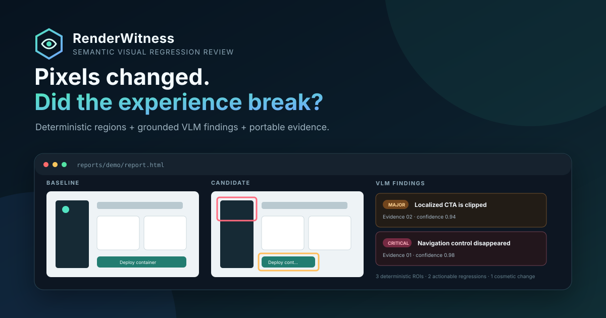
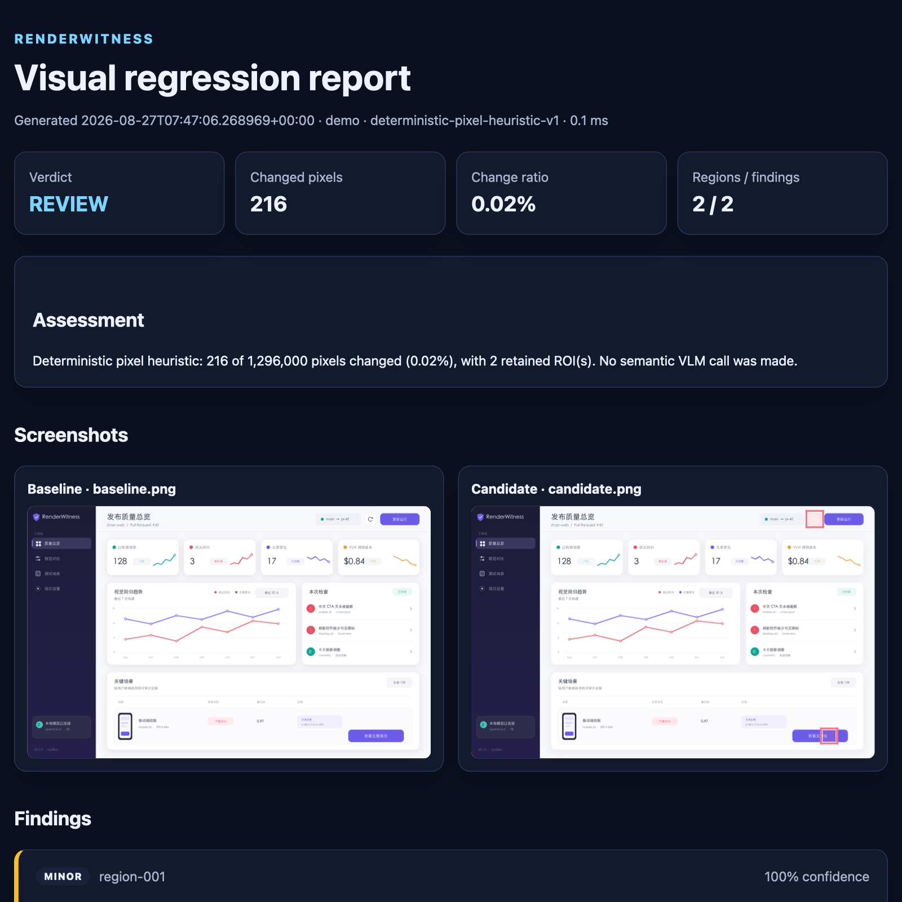

<div align="center">
  
</div>

<p align="center">
  <a href="README.zh-CN.md">中文</a> ·
  <a href="docs/architecture.md">Architecture</a> ·
  <a href="docs/model-guide.md">Model guide</a>
</p>

<p align="center">
  
  
  
</p>

> Screenshot diffs prove that pixels changed. **RenderWitness tells you whether the experience
> broke—and keeps the evidence needed to challenge its answer.**

RenderWitness is an evidence-first visual regression reviewer for web and desktop interfaces. It
finds changed regions with a deterministic image pipeline, then asks a vision-language model to
classify their user impact. The result is a portable HTML + JSON report linking every semantic
finding back to the exact baseline and candidate pixels.

It is designed as a real developer tool, not an image-chat wrapper: deterministic ROI detection,
strict schemas, local-model support, prompt-injection boundaries, reproducible metadata, and CI that
runs without GPU access or API secrets.

## Why it is different

| Layer | What it answers | Trust level |
|---|---|---|
| Pixel evidence | Where did rendering change? | Deterministic |
| VLM review | Is it cosmetic, clipped text, a missing control, layout, or content? | Probabilistic |
| Evidence report | Can a reviewer audit the answer and reproduce it? | Source-linked |

- **Grounded findings** — every claim cites a numbered visual region instead of returning free-form
  prose.
- **CJK regression fixture** — the bundled screenshot pair includes a clipped Chinese action label,
  a missing navigation control, and harmless rendering noise.
- **Local by default** — use Qwen3-VL through Ollama; no PyTorch stack is installed into the app.
- **Honest offline mode** — `demo` is deterministic, clearly labeled synthetic behavior for tests
  and onboarding. It never pretends to be a real model.
- **Portable artifacts** — reports contain images, boxes, metrics, provider metadata, and validated
  findings without a database or hosted dashboard.

## 30-second demo

```bash
python3.12 -m venv .venv
source .venv/bin/activate
python -m pip install -e .

renderwitness demo --output reports/demo
```

Open the HTML path printed by the command. The demo is deterministic and needs no API key, network,
GPU, or model download.

<details>
  <summary><strong>Preview the generated evidence report</strong></summary>
  <br />
  
</details>

Compare your own screenshots in offline evidence mode:

```bash
renderwitness compare baseline.png candidate.png \
  --provider demo \
  --output reports/my-change
```

## Run a real local VLM

[Qwen3-VL](https://github.com/QwenLM/Qwen3-VL) is a strong fit for multilingual OCR, GUI
understanding, and visual grounding. Ollama exposes it through an OpenAI-compatible vision endpoint.

```bash
ollama pull qwen3-vl:4b

export RENDERWITNESS_BASE_URL=http://localhost:11434/v1
export RENDERWITNESS_API_KEY=ollama
export RENDERWITNESS_MODEL=qwen3-vl:4b

renderwitness compare examples/baseline.png examples/candidate.png \
  --provider openai-compatible \
  --output reports/qwen3-vl
```

The same adapter works with a compatible vLLM or hosted endpoint. See the
[model guide](docs/model-guide.md) for reproducibility notes.

## Pipeline

```text
baseline + candidate
        │
        ▼
decode, normalize, bound image size
        │
        ▼
thresholded pixel delta → connected ROI evidence
        │
        ├──────── demo provider (offline CI)
        │
        └──────── OpenAI-compatible VLM (Ollama / vLLM / hosted)
                         │
                         ▼
              strict semantic findings
                         │
                         ▼
           self-contained HTML + JSON report
```

The deterministic evidence survives even if the model fails or returns an invalid claim. Read the
full [architecture note](docs/architecture.md).

## Report contract

Findings are validated before rendering and tied to detected evidence:

```json
{
  "id": "finding-02",
  "region_id": "region-02",
  "category": "text",
  "severity": "major",
  "title": "Localized CTA is clipped",
  "description": "The candidate label ends with an ellipsis inside a narrower button.",
  "confidence": 0.94,
  "suggestion": "Restore intrinsic sizing and add a zh-CN viewport regression case."
}
```

The JSON output also records image hashes, dimensions, diff thresholds, changed-pixel metrics,
provider/model identity, and analysis latency.

## Development

```bash
python -m pip install -e '.[dev]'
make test
make lint
make coverage
```

CI tests Python 3.11–3.13, builds the package and OCI image, and publishes the offline evidence
report as an artifact. See [CONTRIBUTING.md](CONTRIBUTING.md) and [SECURITY.md](SECURITY.md).

## Current scope

Version 0.1 compares equal-size PNG/JPEG/WebP screenshot pairs. VLM findings are reviewer aids, not
proof of accessibility, security, or release readiness. Generated bounding boxes identify source
diff regions; they do not establish causality.

Next milestones are Playwright scenario capture, rootless Podman baseline/candidate runners,
DOM/accessibility-tree evidence, a fault-injection benchmark, and pull-request annotations.

## Author

Built by [Zhexun Hu](https://github.com/RealJasonHu) as a focused portfolio project across VLM
engineering, visual testing, developer tooling, and containers.

Licensed under the [MIT License](LICENSE).
