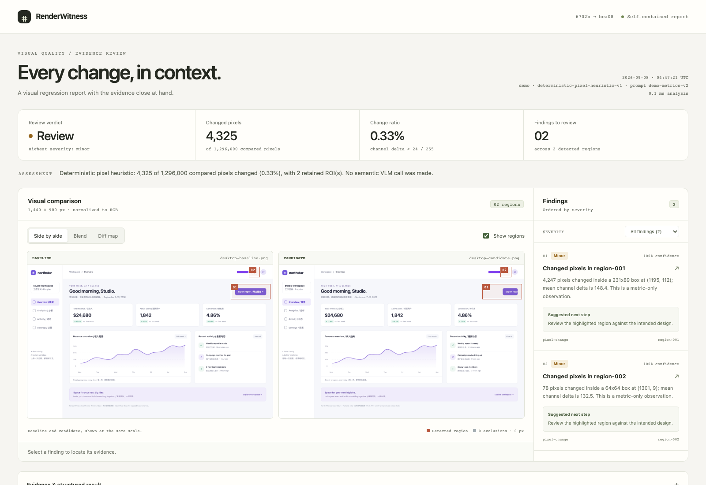

<div align="center">
  
</div>

<p align="center">来自本地浏览器测试页面的实际报告，使用离线 Demo provider，未调用 VLM。</p>

# RenderWitness

**采集截图、定位视觉变化，并在发布前查看可复核的证据。**

[English](README.md) · [使用流程](docs/workflows.md) · [CI 接入](docs/ci.md) · [架构](docs/architecture.md) · [模型接入](docs/model-guide.md)

RenderWitness 是用于截图回归审查的 Python 命令行工具与库。它先执行确定性的像素比较，定位变化区域；再按需调用视觉语言模型（VLM）分析变化含义，最后将原始截图、区域、结论和运行元数据整理为可直接打开的报告。

它适用于单次界面变更排查、CI 中的批量截图比较，以及给已有测试流程补充结构化视觉证据。浏览器采集是可选功能；其他测试工具或桌面应用生成的截图也可以直接使用。

## 已实现的功能

| 能力 | 具体内容 |
|---|---|
| 截图比较 | RGB 差异阈值、变化区域、源文件哈希与输入大小限制 |
| 噪声控制 | 区域合并与边距设置，以及从差异统计中排除指定矩形 |
| 浏览器采集 | 可选的 Playwright Chromium，支持视口、语言、就绪选择器与元素遮罩 |
| 场景批处理 | 严格校验的 JSON 配置、逐场景覆盖设置、单个场景出错后继续运行 |
| CI 判定 | 变化比例预算、严重程度与置信度阈值、待复核状态处理 |
| 交互报告 | 并排、混合与差异视图，严重程度筛选，HTML 与 JSON |
| 批次导出 | HTML 入口、JSON 汇总、Markdown 摘要与 JUnit XML |
| 模型适配 | 无网络的像素启发式 Demo，或 OpenAI-compatible 视觉模型接口 |

像素比较回答“渲染哪里变了”；模型结论辅助解释“这些变化可能意味着什么”。`demo` provider 不调用真实模型，也不能识别文字截断等语义缺陷。

## 先运行离线 Demo

在仓库目录中执行，需要 Python 3.11 或以上版本：

```bash
python3 -m venv .venv
source .venv/bin/activate
python -m pip install -e .

renderwitness demo --output reports/demo
```

用浏览器打开命令输出的 HTML 路径。完成安装后，Demo 不需要 API Key、网络、GPU 或下载模型。内置的中英文合成界面包含人为制造的视觉变化，Demo 结论只描述可计算的像素变化。

## 比较两张截图

```bash
renderwitness compare examples/baseline.png examples/candidate.png \
  --provider demo \
  --output reports/my-change
```

两张图片经过方向校正后的尺寸必须一致。报告链路支持 PNG、JPEG、WebP 和 GIF，动图只比较第一帧。

排除已知动态区域，并限制变化像素不超过 1%：

```bash
renderwitness compare baseline.png candidate.png \
  --ignore-region 1200,0,240,64 \
  --max-change-ratio 0.01 \
  --output reports/release
```

矩形按截图像素填写 `x,y,width,height`，必须完整位于截图内。变化比例以未忽略的像素为分母，发送给模型的图片也会遮盖这些区域，但**报告仍保留原始截图内容**。

## 批量运行场景

```bash
renderwitness suite examples/suite.json --provider demo --output reports/suite
```

输出目录必须是新目录或空目录。这个内置示例预期返回退出码 1：未变化的对照场景通过，人为回归场景失败，仅收集证据的场景通过。

Suite 比较已经存在的截图。图片路径相对于配置文件所在目录解析：

```json
{
  "version": 1,
  "name": "发布前截图检查",
  "defaults": { "threshold": 24 },
  "policy": { "max_change_ratio": 0.01 },
  "scenarios": [
    {
      "id": "overview-desktop",
      "name": "桌面端总览",
      "baseline": "baseline.png",
      "candidate": "candidate.png"
    }
  ]
}
```

输出包括 `index.html`、`summary.json`、`summary.md`、`junit.xml` 和各场景报告。一个场景出错后，其他场景仍会继续运行。模型给出的 verdict 与 CI 规则的判定分别记录；只有违反已配置的规则才会触发门禁失败。

| 退出码 | 含义 |
|---|---|
| `0` | 执行完成，所有已配置的规则通过 |
| `1` | 执行完成，但至少一条规则未通过 |
| `2` | 配置、输入、采集、模型或报告错误；优先级高于规则失败 |

具体规则、失败时的报告保留方式和 GitHub Actions 示例见 [CI 接入](docs/ci.md)。

## 采集浏览器页面

先安装可选依赖和 Chromium：

```bash
python -m pip install -e '.[capture]'
python -m playwright install chromium

renderwitness capture http://localhost:8000/ \
  --output screenshot.png \
  --width 1440 --height 900 --locale zh-CN \
  --wait-for '[data-renderwitness-ready="true"]'
```

Baseline 与 candidate 应使用相同浏览器环境、字体、视口和采集设置。仓库提供了带人为回归的[中英文浏览器示例](examples/README.md)，可以练习“采集 → 比较 → 复核”的完整流程。

安装 Chromium 后，可以直接运行完整的本地浏览器示例：

```bash
python scripts/run_browser_demo.py --output reports/browser-demo
```

脚本验证两个预期失败的回归场景和一个通过的对照场景；结果符合预期时返回 0。报告入口为 `reports/browser-demo/review/index.html`。

## 接入真实视觉模型

适配器要求服务支持 OpenAI-compatible Chat Completions 的图片输入格式。请把下面的模型名替换为本地服务中实际安装的视觉模型：

```bash
export RENDERWITNESS_BASE_URL=http://localhost:11434/v1
export RENDERWITNESS_MODEL=your-vision-model
export RENDERWITNESS_API_KEY=ollama

renderwitness compare examples/baseline.png examples/candidate.png \
  --provider openai-compatible \
  --output reports/model-review
```

适配器发送经过方向与色彩归一化、遮盖忽略区域的截图和变化区域元数据，校验返回 JSON 的结构及区域引用。某条结论可以显式不关联区域。结构校验通过只说明格式有效，不代表模型解释正确。

模型能力要求、环境变量、数据流与失败处理见[模型接入指南](docs/model-guide.md)。离线 Demo 和 CI 测试不能证明真实 VLM 的准确率。

## 文档导航

| 文档 | 内容 |
|---|---|
| [使用流程](docs/workflows.md) | 参数调优、浏览器采集、忽略区域、Suite 配置 |
| [浏览器采集](docs/capture.md) | Python 采集 API、元数据与浏览器验证 |
| [CI 接入](docs/ci.md) | 规则含义、退出码、产物保留、GitHub Actions |
| [架构](docs/architecture.md) | 差异算法、模型边界、输出契约和错误处理 |
| [模型接入](docs/model-guide.md) | 接口要求、配置、真实模型评估方法 |
| [示例](examples/README.md) | 合成截图与浏览器测试页面 |
| [贡献指南](CONTRIBUTING.md) | 开发环境、验证流程与 PR 要求 |
| [更新日志](CHANGELOG.md) | 按版本记录的改动 |
| [安全说明](SECURITY.md) | 漏洞报告与数据注意事项 |

## 开发与验证

```bash
python -m pip install -e '.[dev]'
make test
make lint
make coverage
python -m build
```

测试不需要模型密钥；浏览器冒烟验证还需要 `capture` 可选依赖和 Chromium。

仓库 CI 检查 Python 3.11–3.13、包构建和文档中的 Suite 预期结果；独立 Chromium 任务验证实际采集与报告交互，并保存浏览器示例报告。

## 当前边界

- 项目仍处于 Alpha 阶段。0.2 补齐了浏览器采集和 CI 流程，但不会代管 baseline 审批、登录流程、浏览器交互或截图存储。
- 像素变化不能证明功能、无障碍或发布质量。很小的变化可能重要，大幅改版也可能符合预期；变化框是近似连通区域。
- 置信度由模型自行报告，未经校准。在让语义规则阻止发布前，应先在自己的标注案例上评估模型。
- 浏览器采集使用 Chromium。跨浏览器编排、DOM／无障碍树证据、baseline／candidate 容器编排和 PR 注释尚未实现。
- 报告嵌入原始截图，并包含路径和元数据；分享前需要查看实际内容。忽略区域不能用于隐私脱敏。

由 [Jason Hu](https://github.com/RealJasonHu) 创建，采用 [MIT License](LICENSE)。
